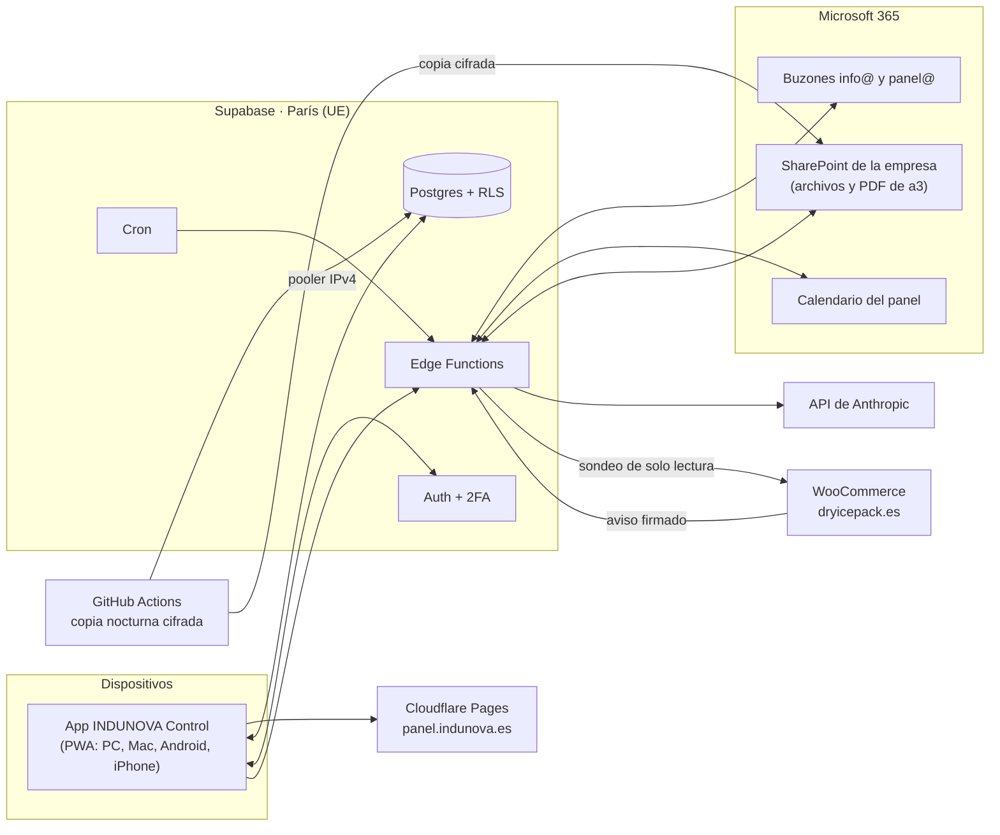

# INDUNOVA Control · Plan

> **Fase 0 · 01/10/2026.** Propuestas P1–P7 aprobadas. **Falta tu OK para empezar la Fase 1.** Todavía no hay código.
> Prototipo para tocar: <https://claude.ai/artifact/LE1oXPeEtAeyoHZk4qZMg8> (archivo: `docs/estilos/propuestas.html`).
> Para hacer ya, sin esperar al panel: [`docs/CANCELAR_ODOO.md`](docs/CANCELAR_ODOO.md).

## Índice

1. [En una página](#1-en-una-página)
2. [Cómo será la app](#2-cómo-será-la-app)
3. [Qué he comprobado y qué cambia](#3-qué-he-comprobado-y-qué-cambia)
4. [Arquitectura](#4-arquitectura)
5. [Modelo de datos](#5-modelo-de-datos)
6. [Coste mensual](#6-coste-mensual)
7. [Fases](#7-fases)
8. [Riesgos](#8-riesgos)
9. [Decisiones y preguntas](#9-decisiones-y-preguntas)
10. [Fuentes](#10-fuentes)

---

## 1. En una página

**Qué es.** Una app instalable en el ordenador y en el móvil (PWA) en `panel.indunova.es`. Entras con una animación del logo de INDUNOVA y eliges uno de cuatro espacios: **Global, INDUNOVA, Dryicepack y Cryocar**. Dentro de cada espacio ves solo lo suyo, con poco texto y todo bien separado. Lo que apuntas en una unidad (una venta, un parte, un servicio) se refleja al momento en Global. **La app la adaptas tú:** creas tus propios campos, editas las listas de opciones y eliges el estilo.

**Con qué.** La app (React) va alojada en Cloudflare Pages. La base de datos está en Supabase, en un centro de datos de la UE (París). Los archivos se guardan en el SharePoint de la empresa, y el correo y el calendario son los de Microsoft 365. La IA es la API de Anthropic.

**Cuánto cuesta:**
- Infraestructura: **0 € al mes mientras construimos.**
- En cuanto entren datos reales, recomiendo **Supabase Pro: 25 $/mes**. Los motivos están en la sección 6.
- IA: unos **20 $/mes** con un uso normal, con un límite de gasto de 40 $/mes.

**Lo que cambia respecto al encargo** (detalle y fuentes en la sección 3):

1. **La navegación son cuatro espacios** con entrada animada, no una barra lateral única. Lo pediste el 01/10/2026.
2. **Supabase Free no hace copias de seguridad** y pausa el proyecto tras 7 días sin uso. La copia nocturna propia es obligatoria, no opcional. Además, los emails de invitación no salen con el correo integrado: los enviaremos con Microsoft 365.
3. **FullCalendar cobra por la vista por recurso** (operarios, vehículos, elevador): su alternativa gratuita obliga a publicar el código. Usaremos **Event Calendar**, que es gratis (licencia MIT) y la incluye.
4. **Microsoft 365:**
   - El acceso de la app a correo y calendario se limita buzón a buzón con «RBAC for Applications».
   - Ese mecanismo **no cubre OneDrive ni SharePoint**: para los archivos hay permisos aparte, también limitados a carpetas concretas.
   - Microsoft desaconseja los secretos en producción: usaremos un **certificado**.
5. **a3:**
   - Exporta el libro de facturas a Excel (gratis).
   - Su API exige el módulo **Conectia**, de pago, que no tenéis: **las facturas entran por sus PDF y por ese Excel**.
   - **a3factura no importa facturas desde Excel**, así que «Datos para a3» será una ficha para copiar.
   - **a3 ya genera remesas SEPA.**
6. **Sabadell:**
   - Extractos en Norma 43 o Excel. CSV no lo ofrece.
   - Desde el 5/10/2025 las guías de la AEB usan **pain.008.001.08** para las remesas. Si el panel las generase, sería en ese formato.
7. **Factura electrónica obligatoria entre empresas.** Ya tiene reglamento (**RD 238/2026**). Para una empresa como INDUNOVA llegaría hacia octubre de 2028 y traerá facturas en XML. Diseñamos ya para poder importarlas.
8. **VeriFactu:** el panel no es un sistema de facturación mientras no emita facturas. Por eso **no hará proformas**, solo presupuestos, y nunca enviará datos a a3 de forma automática.
9. **La API de Anthropic no permite elegir la UE** (solo «global» o EE. UU.). No entrena con nuestros datos ni los guarda por defecto. Habrá que enviarle lo mínimo.
10. **Odoo** (no lo renováis):
    - Se renueva solo si no se avisa **por escrito 30 días antes**.
    - Tras cancelar, la base se borra en **unas 3 semanas**.
    - Hay que descargarlo todo **ya**, sin esperar al panel. Guía paso a paso: [`docs/CANCELAR_ODOO.md`](docs/CANCELAR_ODOO.md).
11. **Las facturas de a3 están en un OneDrive personal** («OneDrive - Personal»), no en el Microsoft 365 de la empresa. Una app de empresa **no puede leerlo**: Microsoft solo da acceso a los datos de la organización. Propuesta **P8**: mover la carpeta «ADMIN INDUNOVA» al SharePoint de la empresa (sección 3.4).
12. **Correo:** conectar los tres info@ es lo normal y no da problemas. En la Fase 3 verás los correos que llegan y **cuáles faltan por contestar**. Los leads y los borradores con IA llegan en la Fase 4.

**Lo que necesito de ti:** las preguntas de la sección 9.3.

---

## 2. Cómo será la app

### 2.1 Entrada y cuatro espacios

1. **Entrada animada con el logo real.** Se forma el isotipo (el núcleo, el anillo y el satélite en órbita), las letras de INDUNOVA suben una a una y aparece el lema, sobre un poco de vapor. Dura unos 2,5 segundos y se salta con un toque. Si el sistema pide menos movimiento, no se anima.
2. **Cuatro iconos grandes:** Global, INDUNOVA, Dryicepack y Cryocar. Cada uno lleva el número de cosas pendientes, como las apps del móvil.
3. **Dentro de cada espacio, siempre lo mismo y poco:**
   - una tarjeta con dos cifras de hoy;
   - el botón de lo que más se hace;
   - una lista corta de secciones.

   Nada de filas de diez cifras.

| Espacio | Lo que se apunta aquí | Secciones |
|---|---|---|
| **Global** | Nada propio: suma lo de las tres | Hielo seco (stock común), facturado del mes, «Hoy en las tres», Avisos, Calendario conjunto, Tareas, Clientes, Finanzas (facturas, cobros, gastos, gestoría), Flota y maquinaria, Equipo y ajustes |
| **INDUNOVA** | Presupuestos, trabajos, partes (con kg de hielo), acreditaciones | Trabajos, Calendario, Presupuestos, Acreditaciones y CAE, Clientes, Correo (info@indunova.es) |
| **Dryicepack** | Ventas, pedidos, cobros en la nave | Pedidos, Stock de hielo, Clientes, Cobros y caja, Reparto y MRW, Correo (info@dryicepack.es) |
| **Cryocar** | Citas y servicios (con kg de hielo) | Agenda del elevador, Servicios, Presupuestos, Clientes, Correo (info@cryocar.es) |

### 2.2 Una sola base de datos

No hay tres programas. Hay **una base de datos** donde cada registro lleva su unidad:

- **Las unidades** leen y escriben lo suyo.
- **Global** lee todo, sumado y con el desglose por unidad.
- **Lo compartido** es de la empresa y se ve desde cada espacio con su filtro: el stock de hielo, los clientes que trabajan con varias unidades, el calendario, la flota y el equipo.

Ejemplo (es exactamente lo que hace el prototipo):

1. En **Dryicepack** pulsas «Nueva venta»: 15 kg de pellet 3 mm, por MRW.
2. Se guarda un **pedido** de Dryicepack y una **salida de hielo** de 15 kg.
3. **El stock común baja** de 2.900 a 2.885 kg, en todos los espacios a la vez.
4. **Global** lo muestra en «Hoy en las tres» y en el desglose de salidas del día.
5. Igual con un parte de INDUNOVA (kg gastados en un trabajo) o un servicio de Cryocar.

### 2.3 Cada persona ve su parte

| Rol | Al entrar ve |
|---|---|
| Administrador (tú y el gerente) | Los cuatro espacios |
| Operario | Solo «Mis trabajos»: los de hoy y mañana, con dirección, hotel, documentos y el parte (también sin cobertura). Nunca importes ni otros clientes |
| Gestoría | Solo «Gestoría»: facturas, gastos, contratos marcados y paquetes para descargar |

«Ver como…» permite a un administrador ver exactamente la pantalla de un operario o de la gestoría, en solo lectura.

### 2.4 Estilo

Cada persona elige su estilo en **Ajustes** (tocando su inicial, arriba a la derecha):
- **Escarcha:** claro.
- **Grafito:** oscuro.
- **Automático** (por defecto): Escarcha de día y Grafito cuando el móvil o el ordenador están en modo oscuro.

Cambiar de estilo no cambia la estructura, solo los colores.

**Tipografía.** Una sola familia, Onest, muy legible, con números que se alinean en columna.

**Colores de unidad** (decisión D4; tokens CSS del proyecto):

| Token | Valor | Texto encima | Nota |
|---|---|---|---|
| `--unit-indunova` | `#E5D61A` | `#1F1C04` (11,4:1) | Amarillo del logo. **Nunca como color de texto** (sobre blanco, 1,5:1). Falta confirmar frente al `#FFCC22` del isotipo suelto (pregunta 9.3) |
| `--unit-dryicepack` | `#B8D0E8` | `#1F3C55` (7,2:1) | «Hielo» de la web nueva. En Escarcha lleva un borde fino para no confundirse con el fondo |
| `--unit-cryocar` | `#1F3449` | `#FFFFFF` (12,8:1) | En Grafito lleva un borde claro para no confundirse con el fondo |

Cada unidad lleva siempre sus iniciales (IN, DI, CC), nunca solo el color. Todos los pares de texto del prototipo cumplen el contraste AA: el más justo está en 5,6:1 y el mínimo es 4,5:1.

**Marca** (`assets/marca/`, redibujada en vector a partir de vuestros archivos):

| Archivo | Uso |
|---|---|
| `indunova-logo.svg` | Logo completo con el nombre en gris `#5A5757`, sobre fondos claros |
| `indunova-logo-negativo.svg` | Igual, con el nombre en blanco, sobre fondos oscuros |
| `indunova-isotipo.svg` | Solo el símbolo, en amarillo: icono de la app y favicon |

Dryicepack y Cryocar usan de momento un icono propio (caja y coche). Si tenéis sus logos, se cambian.

### 2.5 La app la adaptas tú

Decisión D3. Sin tocar código y sin pedírmelo:

| Qué | Cómo | Quién |
|---|---|---|
| **Campos propios** | En cada formulario (venta, parte, servicio, cliente, trabajo, gasto…), **«+ Añadir un campo»**: nombre, tipo (Texto, Número, Fecha, Sí o no, Lista) y si es obligatorio. Se ve al apuntar, en las listas y en la actividad de Global. Se gestionan en Ajustes → Campos propios | Administradores |
| **Listas de opciones** | Formatos, tipos de servicio, categorías de gasto, motivos… se editan en Ajustes. Nada de eso va fijo en el código | Administradores |
| **Estilo** | Escarcha, Grafito o Automático | Cada persona |
| Más adelante | Ordenar y ocultar secciones de cada espacio | Administradores |

Reglas para que no se convierta en un caos:
- **Los cálculos nunca dependen de un campo propio.** El stock, los importes y las alertas usan campos fijos y probados. Un campo propio guarda lo que quieras anotar.
- **Quitar un campo lo oculta**, pero no borra lo que ya se guardó.
- **Un campo propio tiene los mismos permisos que la ficha donde está.** Si algo es confidencial (por ejemplo, un precio), se crea en la parte de importes, que el operario no ve.
- Los campos propios no se envían a la IA salvo que hagan falta para la tarea.

El prototipo ya lo hace: crea «Nº de albarán» en una venta, márcalo como obligatorio y mira cómo aparece en Pedidos y en Global.

---

## 3. Qué he comprobado y qué cambia

**Cómo se ha comprobado:**
- Comprobación del 01/10/2026. Desde este entorno no se pueden abrir muchos dominios oficiales.
- Por eso, la mayoría de datos se ha leído en la **fuente oficial de la documentación en GitHub**: Supabase, Cloudflare, Microsoft Graph, Entra, PowerShell de Exchange, WooCommerce, Odoo y GitHub Docs.
- También en los paquetes de npm, en platform.claude.com (Anthropic) y en developer.apple.com, o con búsquedas limitadas al dominio oficial.
- Lo que solo se ha visto en buscador va marcado como **(búsq.)**.
- Las fuentes están en la sección 10.

### 3.1 Infraestructura

| Supuesto del encargo | Resultado | Qué significa para nosotros |
|---|---|---|
| Supabase Free: límites de BD, pausa y sin copias | **Confirmado.** BD de 500 MB (si se supera, pasa a solo lectura), 1 GB de archivos, 5 GB de tráfico, 50.000 usuarios/mes, 500.000 llamadas a funciones/mes y 2 proyectos gratis. **Se pausa tras 7 días sin actividad** y se puede reactivar durante 1 año (no 90 días). **Sin copias automáticas.** Logs de 1 día | Copia nocturna propia desde el primer día. Unas vacaciones de agosto bastarían para pausarlo |
| Supabase Pro | 25 $/mes con 10 $ de cómputo incluidos: 8 GB de disco, copias diarias durante 7 días, límite de gasto activado por defecto. La recuperación a un momento exacto (PITR) son 100 $/mes extra por cada 7 días: no la necesitamos | Recomendado cuando haya datos reales (sección 6) |
| Región UE | **Confirmado.** UE: Irlanda, París, Fráncfort y Estocolmo. No hay región en España. Londres y Zúrich están fuera de la UE. La región genérica «Europe» puede acabar en ellas | **París (eu-west-3)**, con las Edge Functions fijadas también en París |
| 2FA (TOTP) | **Confirmado.** Gratis en todos los planes | Obligatorio para administradores y gestoría, comprobado también en la base de datos (`aal2`) |
| `pg_cron` y `pg_net` | **Matizado.** No están restringidos por plan. Supabase Cron está en beta (máximo recomendado: 8 tareas a la vez, de hasta 10 min cada una) | Las tareas programadas van ahí |
| Edge Functions | 256 MB de memoria, 2 s de CPU por llamada, 150 s de tiempo total en Free. **Bloquean los puertos de correo 25 y 587** | El correo sale siempre por Microsoft Graph |
| Invitaciones por email | **Corregido.** El correo integrado envía como máximo **2 emails por hora** y solo a miembros del equipo de Supabase. Hace falta SMTP propio o el gancho «Send email», que es gratis | Gancho que envía con Graph desde un buzón compartido del panel. En la Fase 1 creo vuestras dos cuentas a mano |
| Duración de las sesiones | **Corregido.** El cierre por inactividad y la duración máxima de la sesión **solo existen en Pro** | En Free, las sesiones duran hasta cerrar sesión. Lo cerramos en la app si hace falta |
| Copia con `pg_dump` desde GitHub Actions | **Matizado.** La conexión directa a Supabase es solo IPv6 y los runners de GitHub solo tienen IPv4. La guía oficial de Supabase usa la URL directa, que no funciona | Usar el pooler en modo sesión (IPv4), tres volcados (roles, estructura y datos) y la herramienta de Supabase para que coincida la versión de Postgres |
| Contrato de datos (RGPD) con Supabase | **Confirmado.** El DPA va incluido en las condiciones, con cláusulas contractuales tipo de la UE, y no hay que firmar nada. La contraparte es Supabase Pte. Ltd. (Singapur) | Se anota en el registro de tratamientos |
| Cifrado con Vault | Vault funciona (en alfa). pgsodium está pendiente de retirarse | Ciframos el IBAN en la Edge Function, con la clave fuera de la base de datos |
| Cloudflare Pages: gratis y para uso comercial | **Confirmado.** No hay ninguna prohibición de uso comercial. 500 compilaciones al mes. Tráfico de archivos estáticos gratis e ilimitado | Alojamiento de la app |
| Subdominio con DNS en Arsys | **Confirmado en Pages:** basta un CNAME `panel` en Arsys. **Workers exige mover el DNS a Cloudflare.** Cloudflare recomienda Workers para proyectos nuevos, pero no retira Pages | Pages con CNAME, sin tocar el DNS de indunova.es |
| Vercel Hobby no permite uso comercial | **Confirmado** (búsq.): «restricted to non-commercial personal use only» | Descartado |
| GitHub privado gratis | **Confirmado.** Repos privados ilimitados, 2.000 minutos de Actions al mes y 500 MB de artefactos. En privado y gratis no hay «environments»: se usan los secretos del repositorio. Las tareas programadas pueden retrasarse | Suficiente. La copia nocturna dura unos minutos |

### 3.2 Móvil e instalación (PWA)

| Supuesto | Resultado | Qué significa |
|---|---|---|
| Notificaciones en iPhone | **Confirmado. iOS/iPadOS 16.4 o superior**, con la app añadida a la pantalla de inicio. El permiso se pide tras un toque, y toda notificación debe verse (si no, Safari quita el permiso). En la UE sigue funcionando: Apple retiró en 2024 su intento de quitarlo | Documentado en la guía de usuario |
| Funcionar sin conexión | **Matizado.** La sincronización en segundo plano solo existe en Chrome y Edge, no en Safari ni en Firefox. En iOS, las apps de pantalla de inicio no pierden sus datos a los 7 días | El parte se guarda en el móvil y se envía al abrir la app o al volver la cobertura, con aviso de «pendiente de enviar» |
| Instalar en Windows, Mac, Android e iPhone | **Confirmado.** Chrome y Edge en el ordenador; Safari en Mac desde Sonoma («Añadir al Dock»); Chrome en Android; «Añadir a pantalla de inicio» en iPhone | Guía paso a paso en la Fase 1 |

### 3.3 Calendario

| Supuesto | Resultado | Qué significa |
|---|---|---|
| FullCalendar | **Corregido.** Ya va por la v7. Las vistas por recurso y de línea de tiempo son de pago o AGPL (que obligaría a publicar todo el código). No he podido ver el precio | Descartado para la vista por recurso |
| Alternativa | **Event Calendar** (`@event-calendar/core`), licencia MIT. Incluye vistas por recurso, línea de tiempo, lista y arrastrar y soltar. Se actualiza casi cada semana | Lo usaremos, montado en React |

### 3.4 Microsoft 365

| Supuesto | Resultado | Qué significa |
|---|---|---|
| Registrar la app en Entra ID es gratis | **Confirmado.** Entra ID Free va incluido en Microsoft 365. Secreto de 24 meses como máximo, y Microsoft dice que **no se usen secretos en producción** | Certificado desde el principio |
| Limitar la app a los buzones info@ | **Confirmado.** «RBAC for Applications» sustituye a las Application Access Policies (sin fecha de retirada). Se crea un grupo con los buzones y se asigna cada rol solo a ese grupo. Se comprueba con `Test-ServicePrincipalAuthorization` | **Ningún permiso de correo ni de calendario en Entra:** se sumaría al RBAC y daría acceso a todos los buzones. Los cambios tardan de 30 min a 2 h |
| Permisos de OneDrive/SharePoint | **Corregido.** El RBAC solo cubre Exchange. Para archivos existen `Sites.Selected` y los nuevos `*.SelectedOperations.Selected` (ya estables), concedidos sobre un sitio, una biblioteca o una carpeta | Escritura solo en la biblioteca del panel y lectura solo en la carpeta de PDF de a3. Un administrador los concede una vez, fuera de la app. Hay que hacer un **piloto antes de construir**: la documentación de requisitos se contradice |
| Avisos al llegar un correo | **Confirmado.** Las suscripciones duran menos de 7 días y hay que renovarlas. Graph exige respuesta **en 3 s** (si no, se pierden avisos) y una URL de ciclo de vida desde el alta. Para suscribirse hace falta permiso de lectura | La Edge Function contesta al momento y encola el aviso. Renovación diaria. Respaldo con consulta de cambios (delta) cada pocos minutos |
| Calendario compartido con colores | **Matizado.** Graph puede crear el calendario, pero **no envía la invitación para compartirlo**. Las categorías solo tienen **25 colores fijos** por buzón (sin hex). La consulta de cambios en v1.0 solo funciona en el calendario **principal** | Un **buzón compartido `panel@indunova.es`** (gratis) cuyo calendario principal es el del panel. Lo compartís una vez con un comando de administrador. Colores: INDUNOVA = Yellow, Dryicepack = Blue, Cryocar = DarkBlue |
| Avisos de archivos nuevos en OneDrive | **Corregido.** Solo en la raíz y documentados con un permiso que da acceso a todo el tenant | Sin avisos: revisamos la carpeta cada 15 min |
| Borradores y envío tras un clic | **Confirmado.** Para el borrador, `Mail.ReadWrite`; para el envío, `Mail.Send`. Funciona desde buzones compartidos, que no necesitan licencia hasta 50 GB | El clic humano es una regla de la app: ningún permiso puede imponerlo |
| Coste de la API | **Confirmado.** Correo, calendario y archivos están incluidos en la licencia | 0 € |
| EWS | Exchange Online empieza a desactivarlo en octubre de 2026 y lo bloquea el 1/4/2027 (búsq.) | Todo por Graph |
| **Carpeta de facturas de a3** | **Nuevo (01/10/2026).** Vuestras capturas muestran la ruta «OneDrive - Personal › Desktop › ADMIN INDUNOVA › FACTURACIÓN». Es una **cuenta personal de Microsoft**, no la de la empresa. Microsoft: los permisos de aplicación «can be used only to access data owned by that organization and its employees» | **La app no puede leer esa carpeta.** Propuesta **P8**: moverla al SharePoint de la empresa, sincronizado en el Explorador para seguir trabajando igual. Plan B, peor: conectar la cuenta personal con un inicio de sesión que caduca y hay que renovar |
| Saber qué correos faltan por contestar | **Matizado.** Por defecto, lo que alguien envía «como» un buzón compartido no se copia en ese buzón (`MessageCopyForSentAsEnabled` = `$false`) | En la Fase 3 activamos esa copia en los tres info@ (un comando, te lo paso). Un correo cuenta como contestado si en su conversación hay un envío posterior desde ese buzón. Se calcula sin IA. Leer un correo desde el panel no lo marca como leído |

### 3.5 WooCommerce (dryicepack.es)

| Supuesto | Resultado | Qué significa |
|---|---|---|
| Clave de solo lectura | **Confirmado.** Con permiso «Read» solo se puede consultar. Ve lo que vea su usuario de WordPress | Usuario de WordPress dedicado |
| Aviso de pedido nuevo (webhook) | **Corregido.** Va firmado (HMAC-SHA256), pero **no se reintenta**. Se desactiva solo tras varios fallos seguidos (al 7.º). Al activarlo envía un aviso de prueba sin firma que debe recibir un 200 | **El sondeo cada pocos minutos es obligatorio**, no un extra |
| Datos de factura en el pedido | El plugin `dryicepack-tienda` de este repo ya guarda `_billing_nif`, `_dip_factura_datos` (razón social, NIF y dirección), `_dip_fecha_entrega`, `_dip_kg`, `_dip_formatos` y `_dip_factura_mensual` | En la Fase 5, comprobar que la API los devuelve (los campos que empiezan por `_` pueden ocultarse) |
| Bloqueo de bots en Cloudflare | Precaución, sin verificar: dryicepack.es está detrás de Cloudflare | Dejar pasar al panel en `/wp-json/wc/v3/`. Es un ajuste de Cloudflare: te lo pregunto antes |

### 3.6 a3 (Wolters Kluwer)

| Supuesto | Resultado | Qué significa |
|---|---|---|
| Exportar facturas a Excel o CSV | **Confirmado en Excel** (CSV no). En a3factura: Informes → «Listado de facturas expedidas y recibidas (IVA)» → Exportar a Excel. En a3ERP: «Enviar a Excel» | **Segundo adaptador gratuito:** importar ese Excel cada mes para cuadrar con los PDF |
| a3 tiene API | **Confirmado, de pago.** La API REST de a3factura da facturas, PDF, vencimientos, remesas y avisos, pero exige el módulo **Conectia** (precio sin verificar). En a3innuva, Wolters Kluwer crea el acceso cliente a cliente. a3ERP tiene otro módulo | **No tenéis Conectia** (01/10/2026): las facturas entran por los PDF y el Excel |
| Dónde quedan los PDF de a3 | **Visto en vuestras capturas (01/10/2026).** Emitidas: `FACTURAS EMITIDAS/<año>/<MM - MES>/`. Recibidas: `FACTURAS RECIBIDAS/<año>/<MM - Mes>/` y, aparte, `<MM - Mes> PARA CONTABILIZAR/`. Nombres del tipo «FACTURA <año>-F<número> <CONCEPTO>», escritos a mano y con variantes (espacios, guiones bajos); algún escaneo en TIF. Una sola serie «F», unas 17 emitidas en enero de 2026 | El panel lee número, fecha, NIF e importes **del contenido del PDF**, no del nombre, y avisa si dos archivos tienen el mismo número. «PARA CONTABILIZAR» se convierte en el estado «pendiente de pasar a la gestoría». Los TIF se guardan como adjunto de su factura. La unidad la propone el concepto («suministro de hielo» → Dryicepack) y la confirmas tú |
| Importar facturas desde Excel | **Corregido.** a3factura no importa facturas emitidas desde Excel. La contabilidad de la gestoría sí importa «facturas expedidas», pero eso es contabilidad, no emisión | «Datos para a3» = ficha para copiar. Nunca carga automática (ver 3.8) |
| a3 hace remesas SEPA | **Confirmado.** Remesas B2B y CORE con los mandatos en la ficha del cliente. No se publica la versión del XML: se ve abriendo una remesa | Si ya las hacéis en a3, el panel solo prepara la lista y controla devoluciones |
| a3 está adaptado a VeriFactu | **Confirmado** (a3factura y a3ERP v15) | — |

### 3.7 Banc Sabadell, SEPA y Norma 43

| Supuesto | Resultado | Qué significa |
|---|---|---|
| Extractos en Norma 43, Excel o CSV | **Matizado.** Excel, PDF o Norma 43. CSV no aparece. Hay un buzón que acumula un Norma 43 con todo lo nuevo. camt.053, sin confirmar | **Norma 43 como formato principal.** El lector acepta las versiones de la AEB de 2012 y de 2024 |
| Formato de remesa | **Corregido.** Las guías de la AEB que publica Sabadell (adeudos básicos, octubre de 2025; B2B, noviembre de 2025) usan **pain.008.001.08**, vigente desde el 5/10/2025. No está garantizado que acepten la versión .02 | Si el panel genera remesas, en .08. El fichero se firma en BS Online en el plazo de una semana |
| El identificador de acreedor lo da el banco | **Corregido.** Se calcula con el NIF: ES + control + sufijo + NIF. Con sufijo 000 sería **`ES71000B66800103`** (cálculo propio, comprobado con el ejemplo del EPC) | Confirmar el sufijo con Sabadell |
| Dirección estructurada obligatoria en noviembre de 2026 | **Aplazado.** El EPC lo aplazó el 9/9/2026 y fijará la nueva fecha este mes. Dentro del EEE, la dirección del deudor es opcional en los adeudos | Guardamos ya la dirección estructurada (calle, número, CP, municipio, país) |

### 3.8 Normativa

| Supuesto | Resultado | Qué significa |
|---|---|---|
| VeriFactu obligatorio para sociedades desde el 1/1/2027 | **Confirmado.** RD 1007/2023, en la redacción del RDL 15/2025 (convalidado el 11/12/2025): sociedades antes del 1/1/2027 y el resto antes del 1/7/2027. Sin cambios en 2026, aunque se tramita como ley y podría cambiar | a3 se encarga |
| Un programa que solo importa facturas no es «sistema de facturación» | **Confirmado, con matices** | **(1)** Las proformas deben salir del mismo programa que factura: **el panel no hace proformas**. **(2)** Si a3 recibiera datos del panel automáticamente, el panel entraría en la cadena de facturación: **«Datos para a3» manual**. **(3)** La ley sanciona los programas que permiten llevar registros paralelos (art. 201 bis LGT): **el panel es un espejo de a3, no un libro de ventas** |
| Factura electrónica entre empresas, pendiente de reglamento | **Corregido.** Aprobado: **RD 238/2026, de 25 de marzo** | Obligatoria 12 meses (empresas de más de 8 M€) o 24 meses (resto) después de una orden ministerial. Según el borrador, esa orden entraría en vigor el 1/10/2026, lo que daría **octubre de 2027 y octubre de 2028**. No he podido confirmar que esté publicada. Formatos: UBL, CII, EDIFACT o Facturae. Habrá que comunicar el pago de las facturas recibidas. Las simplificadas (particulares) quedan fuera |
| Conservar las facturas años | **Confirmado.** **6 años** (Código de Comercio, art. 30); fiscalmente prescribe a los 4, y **hasta 10** si hay bases negativas o deducciones pendientes. Hay que conservar el **archivo original** con acceso en línea. Si se guarda fuera de España, hay que comunicarlo antes a Hacienda (RD 1619/2012, art. 22.2) | El archivo legal sigue siendo a3 + OneDrive; el panel guarda una copia de trabajo con su huella (hash). Pregunta para la gestoría (9.4) |

### 3.9 Odoo

| Supuesto | Resultado | Qué significa |
|---|---|---|
| El plan Standard no tiene API | **Confirmado.** Solo el plan Custom | Migración por exportaciones |
| Exportar desde las listas | **Confirmado.** Lista → seleccionar → Acción → Exportar (XLSX o CSV), con «exportación compatible con importación». Facturas en PDF: Imprimir → «Export ZIP» | El importador acepta esos archivos |
| Copia completa | **Matizado.** odoo.com/my/databases → Gestionar → «Download Backup» (ZIP). Debería incluir los adjuntos: hay que comprobarlo al abrirlo | Paso de la lista para cancelar |
| Cancelar | **Nuevo.** Se renueva solo si no se avisa por escrito **30 días antes**. Tras cancelar, la base queda desactivada **3 semanas** y se borra (política de privacidad, búsq.) | **No lo renováis** (01/10/2026). Guía: [`docs/CANCELAR_ODOO.md`](docs/CANCELAR_ODOO.md). Falta la fecha de renovación (9.3) |

### 3.10 Inteligencia artificial (Anthropic)

| Supuesto | Resultado | Qué significa |
|---|---|---|
| Claude Pro no incluye la API | **Confirmado.** La API se paga aparte en la Claude Console | Cuenta en la Fase 3 |
| Haiku para leer y clasificar, Sonnet para redactar | **Confirmado con los modelos vigentes:** **Claude Haiku 4.5** (`claude-haiku-4-5`) a 1 $ / 5 $ por millón de tokens de entrada/salida, y **Claude Sonnet 5.5** (`claude-sonnet-5-5`) a 2 $ / 10 $. Sonnet 5.5 cuenta unos 30 % más tokens para el mismo texto | Modelo configurable en Ajustes |
| Batch API más barata | **Confirmado.** 50 % de descuento. Es asíncrona y **guarda los datos 29 días** | Para relecturas nocturnas. El plan de las 05:00 va por la API normal, para no depender de la cola |
| Límite de gasto mensual | **Confirmado.** Console → Settings → Billing → «Spend limits». Al llegar al límite, la API rechaza las peticiones hasta el mes siguiente | El panel pasa a modo manual y avisa |
| Privacidad | **Confirmado.** No entrena con datos de la API, y el DPA va incluido en las condiciones. Por defecto no guarda prompts ni respuestas (salvo lotes, y lo marcado por seguridad). **No hay opción de procesar en la UE**: solo «global» o «us» | Transferencia internacional en el registro. A la IA solo va lo imprescindible: nada de IBAN, DNI ni datos de salud |

---

## 4. Arquitectura

**Piezas**

- **App:** React + Vite + TypeScript + Tailwind CSS + shadcn/ui, instalable (PWA).
  - Para trabajar sin conexión: `vite-plugin-pwa` y Dexie (IndexedDB).
  - Datos y formularios: TanStack Query y React Hook Form con Zod.
  - Gráficos con Recharts, calendario con Event Calendar, firma con `signature_pad`.
  - Fechas con date-fns y `@date-fns/tz` (Europe/Madrid).
  - PDF (presupuestos y órdenes de trabajo) con `@react-pdf/renderer`, que solo se carga cuando hace falta.
  - Todas las librerías son de licencia libre (MIT, salvo Dexie, que es Apache-2.0).
- **Base de datos:** Postgres de Supabase con RLS en todas las tablas y migraciones versionadas.
  - Los cálculos y las alertas son funciones SQL con tests (pgTAP).
  - La lógica de cálculo en TypeScript va en `core/`, con tests de Vitest.
- **Edge Functions (todo lo que lleva secretos):**
  - Graph: correo, calendario y archivos.
  - WooCommerce.
  - IA.
  - Cifrado del IBAN.
  - Notificaciones push.
  - Gancho de emails de Auth.
  - Fijadas en París.
- **Cron:**
  - Sondeo de correo, WooCommerce y OneDrive.
  - Renovación de las suscripciones de Graph.
  - Recálculo de alertas.
  - Plan del día a las 05:00.

**Flujos clave**

1. **Venta o parte:**
   - La app guarda el registro y su movimiento de hielo en una sola transacción.
   - Global se actualiza al momento (Supabase Realtime).
2. **Correo nuevo:**
   - Graph avisa y la Edge Function contesta en menos de 3 s y lo encola.
   - Después se leen los metadatos y la IA clasifica.
   - El cuerpo completo no se guarda: se pide a Graph al abrir el correo.
3. **Factura de a3:**
   - Cada 15 min se revisa la carpeta de OneDrive.
   - Si hay un PDF nuevo, la IA lo lee y tú confirmas con un clic.
   - Los duplicados se detectan por NIF + serie/número + fecha.
   - Desde 2027, el QR VeriFactu de cada factura permite leer esos datos sin IA.
4. **Pedido web:** aviso firmado + sondeo con `modified_after`, idempotente (un pedido nunca entra dos veces).
5. **Parte sin cobertura:**
   - Se guarda en el móvil con un identificador propio.
   - Al volver la señal se envía. Las fotos van a SharePoint y los datos a la base.
   - No puede duplicarse.

**Seguridad**

- **Roles con RLS:**
  - Los importes van en tablas separadas que un operario no puede leer, y la gestoría solo lee lo suyo.
  - Los tests prueban cada rol.
- **«Ver como…»:** la base de datos aplica los permisos del usuario elegido, pero solo si quien lo pide es administrador, y bloquea toda escritura mientras dura.
- **2FA obligatorio:** para administradores y gestoría (política `aal2` en la base).
- **IBAN y mandatos:**
  - Cifrados con AES-GCM en una Edge Function, con la clave en los secretos y no en la base.
  - En pantalla, solo los 4 últimos dígitos.
- **Registro de actividad:** por trigger, sin datos sensibles.

**Copias de seguridad**

- **Cada noche:**
  - GitHub Actions hace tres volcados (roles, estructura y datos) por el pooler.
  - Los cifra con `age` y los sube a la carpeta «Copias» de SharePoint.
  - En la Fase 1, mientras no hay SharePoint, quedan como artefacto cifrado de 30 días.
- **Cada semana:** la misma acción **restaura la última copia** en un Postgres de prueba y comprueba que los datos cuadran.
- Restauración manual documentada en `DESPLIEGUE.md`.

---

## 5. Modelo de datos

**Principios**

- Una base para todo. Cada registro operativo lleva su `business_unit` (`indunova`, `dryicepack` o `cryocar`).
- Lo que se reparte entre unidades (un gasto, un contrato) usa una tabla `*_allocations` con porcentajes.
- Importes en céntimos, con base, IVA, retención y total por separado. Fechas en UTC, que se muestran en Europe/Madrid.
- Global no tiene tablas propias: son **vistas que suman** las tres unidades.
- **Campos propios (D3):** cada ficha editable tiene una columna `custom` (jsonb) con los valores. Su forma la describe `custom_field_definitions`, y un trigger rechaza lo que no encaje (tipo, opciones, obligatorio). Lleva índice GIN para poder filtrar. Las listas de opciones viven en tablas, nunca en el código.

Borrador. Cada fase lo concreta en su migración. «Op.» = qué ve un operario; «Gest.» = qué ve la gestoría.

| Módulo | Tablas | Qué guardan | Op. | Gest. | Fase |
|---|---|---|---|---|---|
| Núcleo | `profiles`, `workers`, `settings`, `targets`, `activity_log`, `integration_status`, `ai_usage` | Usuarios y rol, trabajadores (con o sin usuario), ajustes, objetivos por unidad, registro de actividad, estado de las conexiones, consumo de IA | Su perfil | Su perfil | 1 |
| Personalización | `user_preferences`, `custom_field_definitions`, `option_lists`, `option_items` (+ columna `custom` en cada ficha) | Estilo de cada persona; campos propios (ficha, unidad, nombre, tipo, opciones, obligatorio, orden, oculto desde); listas de opciones editables | Los campos de lo que ve | Los campos de lo que ve | 1 (estilo) / 2 (campos y listas) |
| Tareas | `tasks`, `task_comments`, `task_checklist_items`, `decisions`, `quick_notes` | Tareas y «Pedir algo a…», comentarios, registro de decisiones, notas | Las suyas | Las suyas | 1 |
| Calendario | `events`, `resources`, `resource_bookings` | Eventos propios y espejo de Outlook; operarios, vehículos, máquinas y elevador; reservas | Los de sus trabajos | — | 1 |
| Hielo seco | `ice_movements`, `ice_settings`, `pelletizer_scenarios` | Entradas (compras a SOL), salidas por unidad y destino, ajustes por pesaje; sublimación diaria `TODO` (dato tuyo); previsión 45/120/35 t; escenarios de la peletizadora | Registra consumo en el parte | — | 2* |
| Ventas Dryicepack | `orders`, `order_lines`, `recurring_orders`, `deliveries`, `carrier_incidents` | Pedidos por canal (web, correo, teléfono, recurrente, nave), formato (pellet 3 mm, nugget 16 mm), cajas, entrega, MRW, cobro, tipo de factura | Hoja de reparto, sin importes | — | 2*/6 |
| Comercial | `clients`, `client_units`, `contacts`, `leads`, `catalog_items`, `quotes`, `quote_lines`, `forms`, `form_responses`, `emails`, `commitments` | Clientes con dirección fiscal estructurada; unidades con las que trabajan; leads; catálogo; presupuestos (numeración propia `P-AA-NNN`, «No es una factura»); formularios; metadatos y resumen de correos; compromisos | Nombre, dirección de obra y contacto en planta de sus trabajos (vista) | — | 3/4 |
| Trabajos | `jobs`, `job_financials`, `job_assignments`, `job_prep_items`, `job_travel`, `work_reports`, `work_report_photos`, `recurring_services` | Trabajos y su estado; importes y márgenes (aparte); asignaciones; checklist de preparación; hotel y transporte; partes (horas, kg, firma, conformidad); fotos; servicio diario de TMB | Los suyos, sin importes | — | 2*/5 |
| CAE | `company_documents`, `training_types`, `worker_credentials`, `cae_platforms`, `client_requirements`, `cae_validations`, `work_permits` | Documentos de empresa, cursos, acreditaciones por trabajador (salud: solo apto o no apto y fecha), plataformas (solo enlace), qué exige cada cliente, semáforo y permisos | Las suyas | — | 5 |
| Flota | `vehicles`, `machines`, `maintenance_events` | ITV, seguro, revisiones, horas y averías (incluido el elevador) | Las de sus trabajos | — | 5 |
| Finanzas | `invoices`, `invoice_links`, `invoice_allocations`, `payments`, `bank_statements`, `bank_movements`, `reconciliations`, `sepa_mandates`, `sepa_batches`, `sepa_returns`, `cash_movements`, `cash_counts`, `suppliers`, `expenses`, `expense_allocations`, `contracts`, `contract_templates`, `accountant_packages` | Facturas importadas (origen PDF, Excel o XML; archivo y hash; estado de cobro y «pendiente de pasar a la gestoría»); cobros; extractos y movimientos; conciliación; mandatos (IBAN cifrado); remesas y devoluciones; caja y arqueos; proveedores; gastos con reparto; contratos; paquetes para la gestoría | — | Facturas, gastos, contratos marcados y paquetes (lectura) | 2*/3/7 |
| Inteligencia | `alerts`, `alert_rules`, `daily_plans`, `knowledge_pages`, `projects`, `notifications`, `push_subscriptions` | Avisos (tipo, gravedad, unidad, enlace, pospuesto hasta), umbrales, plan del día, Memoria, proyectos, notificaciones y dispositivos | Los suyos | — | 1→8 |
| Documentos | `documents` | Metadatos de archivos de SharePoint (ruta, tipo, tamaño, hash, a qué pertenece) y miniatura | Los de sus trabajos y los suyos | Los de sus facturas, gastos y contratos | 3 |

La columna «Fase» sigue el orden aprobado de la sección 7. \* = la parte manual se adelanta a la Fase 2 (P1, aprobada el 01/10/2026): stock de hielo, ventas, partes simples, cobro en la nave y caja.

---

## 6. Coste mensual

### 6.1 Infraestructura

| Servicio | Plan | Coste | Comentario |
|---|---|---|---|
| Cloudflare Pages | Free | 0 € | Uso comercial permitido |
| Supabase | Free → **Pro** | 0 € → **25 $/mes** | Ver abajo |
| GitHub | Free (privado) | 0 € | 2.000 min/mes de Actions |
| Microsoft 365 | Ya lo pagáis | 0 € extra | Graph incluido; `panel@` es un buzón compartido gratuito |
| Dominio indunova.es | Ya lo pagáis (Arsys) | 0 € | Solo un CNAME |
| Notificaciones push | Estándar web | 0 € | — |
| a3 Conectia (opcional) | De pago | Sin verificar | Solo si queréis leer las facturas por API |

**Cuándo pasar a Supabase Pro.** En la Fase 1 basta Free: no hay datos reales y solo lo usáis vosotros dos. Recomiendo pasar a **Pro (25 $/mes, unos 23 €)** cuando entren datos de verdad (Fase 2), por cuatro razones:

- Free no tiene copias automáticas (la nuestra sigue siendo la segunda copia, fuera de Supabase).
- Una semana sin uso (agosto) pausa el panel y deja de entrar pedidos y correo.
- Las sesiones con caducidad solo existen en Pro.
- Los logs solo duran 1 día.

Pro incluye un límite de gasto activado por defecto: no hay sustos.

### 6.2 IA (estimación con precios oficiales del 01/10/2026)

Los volúmenes son **supuestos**: con tus cifras reales (pregunta 9.3) la afino.

| Función | Modelo | Usos al mes (supuesto) | Coste/mes |
|---|---|---|---|
| Clasificar correo entrante | Haiku 4.5 | 880 (60 al día, menos publicidad filtrada sin IA) | 2,9 $ |
| Compromisos en correo enviado | Haiku 4.5 | 525 | 1,2 $ |
| Borradores de respuesta | Sonnet 5.5 | 170 | 2,4 $ |
| Facturas de a3 (PDF) | Haiku 4.5 (lotes) | 80 (unas 17 emitidas, según enero de 2026; el resto, recibidas) | 0,4 $ |
| Gastos y tickets | Haiku 4.5 | 120 | 0,7 $ |
| Documentos CAE | Haiku 4.5 | 30 | 0,2 $ |
| Plan del día (2 administradores) | Sonnet 5.5 | 60 | 3,5 $ |
| Preparación de reuniones | Sonnet 5.5 | 26 | 1,0 $ |
| Asistente (preguntas) | Sonnet 5.5 (con caché) | 315 | 8,3 $ |
| **Total** | | | **≈ 20 $/mes** (uso bajo: 10 $; alto: 41 $) |

**Límite recomendado en la Console: 40 $/mes**, con aviso interno en el panel a partir de 25 $. Si se alcanza, el panel sigue en modo manual.

### 6.3 Total

| Momento | Infraestructura | IA | Total |
|---|---|---|---|
| Fases 1 y 2 sin IA | 0 € | 0 € | **0 €** |
| Con datos reales y sin IA | 25 $ | 0 € | **25 $** |
| Con todo funcionando | 25 $ | ≈ 20 $ | **≈ 45 $/mes** (unos 41 €) |

---

## 7. Fases

Cada fase termina desplegada y probada. Te digo qué se ha hecho, cómo probarlo, qué tienes que hacer y qué queda pendiente. **Después, paro.**

**P1, aprobada el 01/10/2026:** el hielo seco y las ventas o partes manuales se adelantan a la Fase 2. Es lo que describiste («apunto una venta, baja el stock y se ve en Global») y hace la app útil muy pronto, sin depender de Microsoft ni de a3. Las fases quedan así:

| Fase | Contenido | Lo que tendrás que hacer tú |
|---|---|---|
| **1 · Base** | <ul><li>Repo privado y despliegue en `panel.indunova.es`.</li><li>PWA instalable.</li><li>Entrada animada con el logo y cuatro espacios con su estructura («Próximamente» en lo que falte).</li><li>Estilo a elegir: Escarcha, Grafito o Automático.</li><li>Usuarios con 2FA, roles, RLS con tests y «Ver como…».</li><li>Global básico.</li><li>Tareas con «Pedir algo a…».</li><li>Calendario conjunto con colores.</li><li>Copia nocturna con restauración probada.</li></ul> | <ul><li>Crear cuentas en GitHub, Supabase y Cloudflare (te guío).</li><li>Añadir el CNAME en Arsys.</li><li>Instalar la app en PC y móvil.</li></ul> |
| **2 · Apuntar y sumar** (P1) | <ul><li>Stock de hielo común (compras a SOL, pesajes, sublimación).</li><li>Ventas manuales de Dryicepack (incluida la venta en la nave en 20 s), con cobro en la nave y caja.</li><li>Partes simples de INDUNOVA y servicios de Cryocar con kg de hielo.</li><li>Campos propios y listas de opciones editables en esos formularios.</li><li>Global con stock, salidas por unidad y actividad.</li></ul> | <ul><li>Pasar Supabase a Pro.</li><li>Darme el % de sublimación (o lo medimos con pesajes).</li></ul> |
| **3 · Datos reales** | <ul><li>Microsoft 365: app con certificado y piloto de permisos de archivos.</li><li>Correo de los tres info@: los que llegan y cuáles faltan por contestar (sin IA).</li><li>Documentos en SharePoint.</li><li>Importación de Odoo (clientes y productos) desde los Excel ya descargados.</li><li>Facturas de a3: PDF con IA y Excel del libro.</li><li>Cifras reales en Global con objetivos.</li></ul> | <ul><li>Mover «ADMIN INDUNOVA» al SharePoint de la empresa (P8, te guío).</li><li>Registrar la app en Entra.</li><li>Crear `panel@` y conceder los permisos, incluido el RBAC de los info@ (te paso los comandos).</li><li>Pasarme las exportaciones de Odoo.</li><li>Cuenta en la Claude Console con límite de gasto.</li></ul> |
| **4 · Comercial** | <ul><li>Correo con IA: clasificación, leads y borradores (y bandeja conjunta en Global).</li><li>Presupuestos con PDF y envío tras un clic.</li><li>Clientes completo.</li><li>Formularios.</li></ul> | — |
| **5 · Operación** | <ul><li>Trabajos con preparación, logística y orden de trabajo.</li><li>Parte móvil sin conexión.</li><li>Acreditaciones y CAE.</li><li>Flota y maquinaria.</li><li>Calendario de Outlook.</li></ul> | Compartir el calendario de `panel@` |
| **6 · Dryicepack conectado** | <ul><li>WooCommerce (aviso + sondeo).</li><li>MRW.</li><li>Recurrentes.</li><li>Reparto.</li><li>TMB diario.</li><li>Calculadora de la peletizadora.</li></ul> | <ul><li>Clave de solo lectura y webhook en WooCommerce.</li><li>Decidir el ajuste de Cloudflare para el panel.</li></ul> |
| **7 · Finanzas** | <ul><li>Norma 43 y conciliación.</li><li>Remesas: control, o XML .08 si a3 no las hace.</li><li>Caja de las tres unidades.</li><li>Gastos con foto.</li><li>Contratos.</li><li>Gestoría (rol propio).</li></ul> | Descargar extractos del banco |
| **8 · Inteligencia y análisis** | <ul><li>Plan del día a las 05:00.</li><li>Compromisos.</li><li>Preparación de reuniones.</li><li>Asistente y Memoria.</li><li>Analytics y Proyectos.</li><li>Notificaciones push.</li><li>Resumen por correo.</li></ul> | — |
| **9 · Opcional** | <ul><li>Analítica web y de anuncios.</li><li>Registro de jornada.</li><li>Apps de tienda (Capacitor).</li><li>Instalador de escritorio (Tauri).</li><li>WhatsApp Business.</li></ul> | Solo si lo pides |

**Ahora, sin esperar a ninguna fase:** descargar Odoo y avisar de que no se renueva ([`docs/CANCELAR_ODOO.md`](docs/CANCELAR_ODOO.md)).

**En todas las fases:**
- Tests de toda la lógica de cálculo.
- Migraciones versionadas.
- Prueba en móvil real.
- Ningún dato real en el repositorio.

---

## 8. Riesgos

| Riesgo | Qué haremos |
|---|---|
| Copias y pausa del plan Free de Supabase | Copia nocturna cifrada fuera de Supabase con restauración semanal automática; Pro desde la Fase 2 |
| La app de Microsoft acaba con acceso a todos los buzones | Ningún permiso de correo en Entra, solo RBAC por grupo, comprobado con `Test-ServicePrincipalAuthorization` antes de conectar nada |
| Permisos de archivos (`*.Selected`) con documentación contradictoria | Piloto en la Fase 3 antes de construir; plan B: mover la carpeta de PDF a la biblioteca del panel |
| Avisos de Graph perdidos (respuesta en 3 s) o caducados | Responder y encolar; renovación diaria; consulta de cambios (delta) de respaldo |
| WooCommerce no reintenta sus avisos | Sondeo obligatorio y entrada idempotente |
| La IA se equivoca al leer una factura | Siempre confirmas tú; nivel de confianza visible; duplicados por NIF + número + fecha; cuadre mensual con el Excel de a3 |
| El panel se considera sistema de facturación o registro paralelo | Sin proformas ni numeración fiscal, sin carga automática en a3, espejo de a3. Consulta a la gestoría (9.4) |
| Transferencias internacionales (Anthropic, Supabase, GitHub) | Contratos incluidos (DPA con cláusulas tipo), registro de tratamientos y mínimo de datos a la IA |
| Partes sin cobertura que no se envían (iPhone) | Cola en el móvil, aviso visible de «pendiente de enviar» y reenvío al abrir la app |
| Colores del calendario de Outlook distintos en cada móvil | Colores de categoría limitados a 25; en la app los colores son los nuestros |
| Gasto de IA inesperado | Límite en la Console, consumo por función en Ajustes y modo manual |
| Odoo se renueva sin querer o se borra con datos dentro | Guía `docs/CANCELAR_ODOO.md`: fecha, copia completa comprobada, Excel de cada lista y aviso por escrito; segunda descarga la última semana |
| Facturas de la empresa en un OneDrive personal | P8: moverlas al SharePoint de la empresa antes de la Fase 3. Mientras tanto, mantener una copia en un disco externo |
| Correos contestados desde el móvil o desde otra cuenta que el panel no ve | Copia de enviados activada en los info@ y prueba con respuestas reales en la Fase 3, antes de fiarse de «sin contestar» |
| Demasiados campos propios o campos que nadie rellena | Solo los crean administradores; quitar es ocultar; los cálculos nunca dependen de ellos; Ajustes muestra cuántas fichas usan cada campo |
| Proyecto grande para mantener entre los dos | Pila simple, documentación, tests y fases pequeñas que siempre funcionan |

---

## 9. Decisiones y preguntas

### 9.1 Decisiones tomadas

| N.º | Decisión | Quién y cuándo |
|---|---|---|
| D1 | Navegación por **espacios**: entrada animada con el logo, cuatro iconos (Global, INDUNOVA, Dryicepack, Cryocar), poco y bien separado dentro de cada uno, y todo lo de las unidades sumado en Global. Sustituye a la barra lateral única del apartado 8 del encargo | Andrés, 01/10/2026 |
| D2 | **Propuestas P1 a P7 aprobadas** (tabla 9.2) | Andrés, 01/10/2026 |
| D3 | **La app la adapta el usuario:** campos propios en cada formulario, listas de opciones editables y estilo a elegir (Escarcha, Grafito o Automático). Sustituye a la P6 (elegir un solo estilo). Detalle en 2.5 | Andrés, 01/10/2026 |
| D4 | **Marca y colores:** logo real de INDUNOVA (`assets/marca/`), INDUNOVA `#E5D61A`, Dryicepack `#B8D0E8`, Cryocar `#1F3449` | Andrés, 01/10/2026 (el amarillo, pendiente de confirmar) |
| D5 | **Odoo no se renueva.** Se descarga todo antes y se importa en la Fase 3 | Andrés, 01/10/2026 |
| D6 | **Sin Conectia:** las facturas de a3 entran por sus PDF y por el Excel del libro | Andrés, 01/10/2026 |
| D7 | **Los tres info@ (buzones compartidos) conectados a la app:** ver lo que llega y lo que falta por contestar en la Fase 3; leads y borradores con IA en la Fase 4 | Andrés, 01/10/2026 |
| D8 | **Repositorio privado propio** `indunova-control`, fuera del de la web | Andrés, 01/10/2026 |

### 9.2 Propuestas

| N.º | Propuesta | Estado |
|---|---|---|
| P1 | Adelantar a la Fase 2 el hielo seco y las ventas o partes manuales (sección 7) | Aprobada |
| P2 | Supabase Pro (25 $/mes) desde la Fase 2 | Aprobada |
| P3 | Cloudflare Pages con un CNAME en Arsys, sin mover el DNS | Aprobada |
| P4 | Event Calendar (gratis) en lugar de FullCalendar | Aprobada |
| P5 | Buzón compartido `panel@indunova.es` para el calendario del panel y los emails del sistema | Aprobada |
| P6 | Estilo: Escarcha, Grafito, o uno en el móvil y otro en el ordenador | Sustituida por D3: cada uno elige |
| P7 | Región de Supabase: París | Aprobada |
| **P8** | **Mover «ADMIN INDUNOVA» del OneDrive personal al SharePoint de la empresa**, sincronizado en el Explorador de Windows para seguir guardando los PDF igual que ahora. Es lo único que permite que el panel lea las facturas sin guardar contraseñas, y saca documentos de la empresa de una cuenta personal | **Pendiente de tu OK.** Recomiendo sí, antes de la Fase 3. Coste: 0 € si vuestro plan incluye SharePoint (pregunta 1) |

### 9.3 Preguntas para ti

**Para empezar la Fase 1:**

1. **Microsoft 365:** ¿qué plan tenéis y quién es el administrador global? Lo ves en admin.microsoft.com → Facturación → Sus productos (en inglés, Billing → Your products). Me basta una captura de esa página. Así sé si incluye SharePoint (P8).
2. **Amarillo de INDUNOVA:** el logo usa `#E5D61A` y el isotipo suelto `#FFCC22`. He elegido `#E5D61A`. ¿Es el bueno?
3. **Odoo:** la fecha en que termina el periodo (paso 1 de [`docs/CANCELAR_ODOO.md`](docs/CANCELAR_ODOO.md)).

**Para más adelante (Fase 3):**

4. **a3:** una captura de la pantalla principal del programa, o de «Ayuda → Acerca de». Así sé qué producto es (a3factura, a3ERP, a3innuva…). Sin datos de clientes a la vista.
5. **Remesas:** ¿se preparan en a3 o en la web del Sabadell?
6. **Volumen aproximado:** correos al día en los tres buzones y tickets de gasto al mes. Las facturas ya las sé: unas 17 emitidas al mes.
7. **Móviles:** ¿qué móvil usáis tu padre y tú? Para las notificaciones en iPhone hace falta iOS 16.4 o superior.

### 9.4 Para la gestoría, Sabadell o Wolters Kluwer (sin prisa)

- **Gestoría:**
  - ¿Está INDUNOVA en el SII? Si es así, no le aplica el reglamento VeriFactu.
  - ¿Hay que comunicar a Hacienda que las facturas se guardan en OneDrive, con servidores posiblemente fuera de España?
  - ¿Os vale el Excel resumen para el paquete trimestral?
- **Sabadell:**
  - Identificador de acreedor y sufijo dados de alta.
  - ¿Aceptan todavía pain.008.001.02?
  - ¿Está activo el buzón de Norma 43?
  - ¿Ofrecen camt.053?
- **Wolters Kluwer:** precio de Conectia, si algún día interesa la API.

---

## 10. Fuentes

Consultadas el 01/10/2026. Se da la URL pública; si se leyó en su fuente oficial en GitHub, se indica el repositorio. **(búsq.)** = solo extracto de buscador limitado al dominio oficial.

**Supabase** (fuente: github.com/supabase/supabase)
- Precios y planes: https://supabase.com/pricing
- Facturación: https://supabase.com/docs/guides/platform/billing-on-supabase
- Pausa de proyectos gratis: https://supabase.com/docs/guides/platform/free-project-pausing
- Copias: https://supabase.com/docs/guides/platform/backups
- Regiones: https://supabase.com/docs/guides/platform/regions
- Límites de Edge Functions: https://supabase.com/docs/guides/functions/limits
- Ejecución regional: https://supabase.com/docs/guides/functions/regional-invocation
- Conexión a Postgres: https://supabase.com/docs/guides/database/connecting-to-postgres
- MFA: https://supabase.com/docs/guides/auth/auth-mfa
- Sesiones: https://supabase.com/docs/guides/auth/sessions
- SMTP: https://supabase.com/docs/guides/auth/auth-smtp
- Cron: https://supabase.com/docs/guides/cron
- Vault: https://supabase.com/docs/guides/database/vault
- Tests: https://supabase.com/docs/guides/database/testing
- DPA: https://supabase.com/legal/customer-resources/data-processing-addendum
- Condiciones: https://supabase.com/terms

**Cloudflare** (fuente: github.com/cloudflare/cloudflare-docs)
- Límites de Pages: https://developers.cloudflare.com/pages/platform/limits/
- Dominios propios en Pages: https://developers.cloudflare.com/pages/configuration/custom-domains/
- Dominios en Workers: https://developers.cloudflare.com/workers/configuration/routing/custom-domains/
- Archivos estáticos en Workers: https://developers.cloudflare.com/workers/static-assets/billing-and-limitations/
- Condiciones: https://www.cloudflare.com/terms/ (búsq.)

**Vercel:** https://vercel.com/docs/limits/fair-use-guidelines (búsq.)

**GitHub** (fuente: github.com/github/docs)
- Planes: https://docs.github.com/en/get-started/learning-about-github/githubs-plans
- Facturación de Actions: https://docs.github.com/en/billing/concepts/product-billing/github-actions
- Eventos programados: https://docs.github.com/en/actions/reference/workflows-and-actions/events-that-trigger-workflows
- Rebaja de precios de 2026: https://github.blog/changelog/2026-01-01-reduced-pricing-for-github-hosted-runners-usage/

**PWA**
- Web Push en Safari: https://developer.apple.com/documentation/usernotifications/sending-web-push-notifications-in-web-apps-and-browsers
- DMA en la UE: https://developer.apple.com/support/dma-and-apps-in-the-eu/
- Safari 18.4: https://developer.apple.com/documentation/safari-release-notes/safari-18_4-release-notes
- Compatibilidad de navegadores (MDN): https://github.com/mdn/browser-compat-data
- Política de almacenamiento: https://webkit.org/blog/14403/updates-to-storage-policy/ (búsq.)

**Calendario**
- Licencia de FullCalendar: https://fullcalendar.io/license (paquetes de npm)
- Event Calendar: https://www.npmjs.com/package/@event-calendar/core

**Microsoft** (fuentes: github.com/microsoftgraph/microsoft-graph-docs-contrib, MicrosoftDocs/entra-docs y MicrosoftDocs/office-docs-powershell)
- RBAC for Applications: https://learn.microsoft.com/en-us/exchange/permissions-exo/application-rbac (búsq.)
- Cmdlet de Application Access Policies: https://learn.microsoft.com/powershell/module/exchangepowershell/new-applicationaccesspolicy
- Comprobar permisos de la app: https://learn.microsoft.com/powershell/module/exchangepowershell/test-serviceprincipalauthorization
- Suscripciones: https://learn.microsoft.com/en-us/graph/api/resources/subscription
- Entrega por webhook: https://learn.microsoft.com/en-us/graph/change-notifications-delivery-webhooks
- Permisos «Selected»: https://learn.microsoft.com/en-us/graph/permissions-selected-overview
- Compartir calendarios: https://learn.microsoft.com/en-us/graph/outlook-share-or-delegate-calendar
- Categorías de Outlook: https://learn.microsoft.com/en-us/graph/api/resources/outlookcategory
- Límites de uso: https://learn.microsoft.com/en-us/graph/throttling-limits
- APIs de pago: https://learn.microsoft.com/en-us/graph/metered-api-overview
- Credenciales de la app: https://learn.microsoft.com/en-us/entra/identity-platform/how-to-add-credentials
- Permisos de aplicación solo para datos de la organización: https://learn.microsoft.com/en-us/entra/identity-platform/v2-oauth2-client-creds-grant-flow
- Copia de lo enviado desde un buzón compartido (`MessageCopyForSentAsEnabled`): https://learn.microsoft.com/powershell/module/exchangepowershell/set-mailbox

**WooCommerce** (fuentes: github.com/woocommerce/woocommerce-rest-api-docs y woocommerce/woocommerce)
- API REST: https://woocommerce.github.io/woocommerce-rest-api-docs/
- Código de los webhooks: `plugins/woocommerce/includes/class-wc-webhook.php`

**a3** (búsq.)
- Asesorías: https://www.wolterskluwer.com/es-es/solutions/a3factura/asesorias
- API (guía rápida): https://a3developers.wolterskluwer.es/doc/a3factura/guia-rapida/
- API (Conectia): https://a3developers.wolterskluwer.es/doc/a3factura/conectia/
- Informes: https://a3responde.wolterskluwer.com/es/s/article/infomes-a3factura-a3factura
- Remesas: https://a3responde.wolterskluwer.es/documentos/a3factura/remesas-de-cobro-web.html
- VeriFactu: https://www.wolterskluwer.com/es-es/solutions/a3/novedades-legales/software-verifactu

**Banc Sabadell y SEPA** (búsq.)
- Ficheros y aplicaciones: https://www.bancsabadell.com/cs/Satellite/SabAtl/Ficheros-y-aplicaciones/1191350664150/es/
- Folleto de adeudos SEPA, esquema básico (octubre 2025): https://www.bancsabadell.com/bsnacional/es/folleto_ordenes_en_formato_iso_20022_para_emision_de_adeudos_directos_sepa_esquema_basico_octubre_2025_es.pdf
- Folleto de adeudos SEPA, esquema B2B (noviembre 2025): https://www.bancsabadell.com/bsnacional/es/folleto_ordenes_en_formato_iso_20022_para_emision_de_adeudos_directos_sepa_esquema_b2b_noviembre_2025_es.pdf
- Norma 43: https://www.bancsabadell.com/bsnacional/es/informacion_normalizada_de_cuenta_corriente_es.pdf
- EPC, aplazamiento de las direcciones: https://www.europeanpaymentscouncil.eu/news-insights/news/epc-delays-address-format-migration-timeline
- EPC, identificador de acreedor (EPC262-08): https://www.europeanpaymentscouncil.eu/sites/default/files/kb/file/2024-11/EPC262-08%20v11.0%20Creditor%20Identifier%20Overview.pdf

**Normativa** (texto consolidado del BOE leído en una copia espejo de GitHub y cotejado con boe.es)
- RD 1007/2023: https://www.boe.es/buscar/act.php?id=BOE-A-2023-24840
- RDL 15/2025: https://www.boe.es/buscar/doc.php?id=BOE-A-2025-24446
- Orden HAC/1177/2024: https://www.boe.es/buscar/act.php?id=BOE-A-2024-22138
- RD 238/2026: https://www.boe.es/buscar/act.php?id=BOE-A-2026-7295
- RD 1619/2012: https://www.boe.es/buscar/act.php?id=BOE-A-2012-14696
- Ley General Tributaria: https://www.boe.es/buscar/act.php?id=BOE-A-2003-23186
- Código de Comercio: https://www.boe.es/buscar/act.php?id=BOE-A-1885-6627
- FAQ de la AEAT sobre VeriFactu: https://sede.agenciatributaria.gob.es/Sede/iva/sistemas-informaticos-facturacion-verifactu/preguntas-frecuentes/cuestiones-generales-ambitos-aplicacion.html (búsq.)

**Odoo** (fuente: github.com/odoo/documentation)
- Precios: https://www.odoo.com/pricing
- API externa: https://www.odoo.com/documentation/19.0/developer/reference/external_api.html
- Exportar e importar: https://www.odoo.com/documentation/19.0/applications/essentials/export_import_data.html
- Odoo Online: https://www.odoo.com/documentation/19.0/administration/odoo_online.html
- Condiciones: https://www.odoo.com/documentation/19.0/legal/terms/enterprise.html

**Anthropic**
- Precios: https://platform.claude.com/docs/en/about-claude/pricing
- Límites de gasto: https://platform.claude.com/docs/en/api/rate-limits
- Retención de datos: https://platform.claude.com/docs/en/manage-claude/api-and-data-retention
- Residencia de datos: https://platform.claude.com/docs/en/manage-claude/data-residency
- Condiciones comerciales: https://www.anthropic.com/legal/commercial-terms
- Pro y API se pagan aparte: https://support.claude.com/en/articles/9876003 (búsq.)
